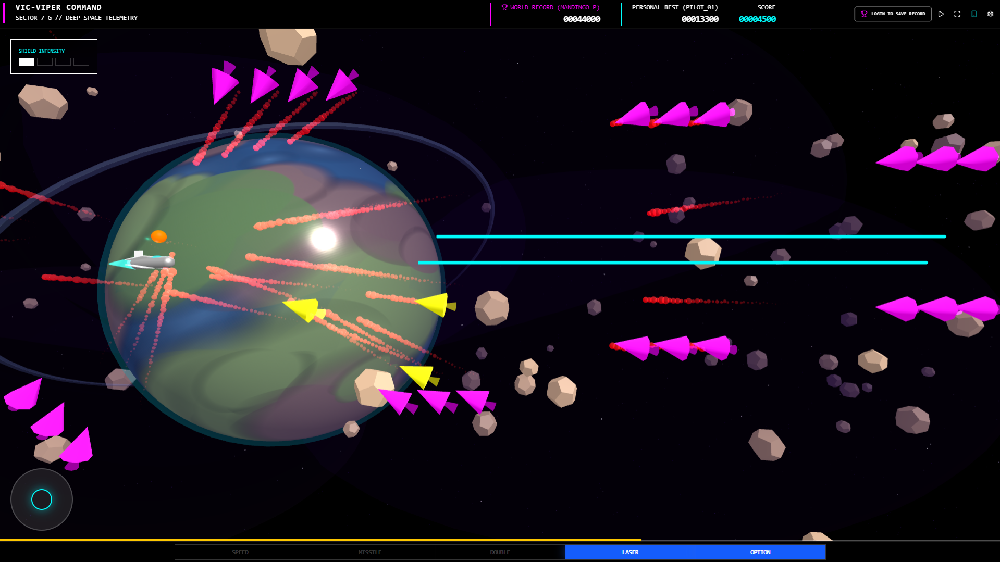

# Vic-Viper Command

A deep space telemetry and combat simulator.



## Run Locally

### Prerequisites
- **Node.js & npm**: You need Node.js installed on your computer. `npm` (Node Package Manager) comes bundled with Node.js.
  - **Windows Users**: 
    1. Download the "LTS" installer from [nodejs.org](https://nodejs.org/).
    2. Run the `.msi` installer and follow the prompts (keep the default settings).
    3. Once installed, open **PowerShell** or **Command Prompt** and type `node -v` and `npm -v` to verify it's working.
  - **macOS/Linux**: Use your package manager or download from the official site.

### Setup
1. **Clone the repository** (or download the source).
2. **Open a Terminal**: On Windows, search for "PowerShell" or "CMD" in the Start menu, and navigate to the folder where you downloaded the code (e.g., `cd C:\Users\YourName\Downloads\ViperCommand`).
3. **Install dependencies**:
   ```bash
   npm install
   ```
3. **Configure Environment Variables**:
   Create a `.env.local` file in the root directory and add your Gemini API key:
   ```env
   GEMINI_API_KEY=your_api_key_here
   ```
4. **Run the app**:
   ```bash
   npm run dev
   ```

## Features
- 3D Background rendering with Three.js.
- Real-time particle systems for trails and explosions.
- Arcade-style score popups.
- Mobile-friendly controls with virtual joystick.
- Global High Score tracking via Firebase.
